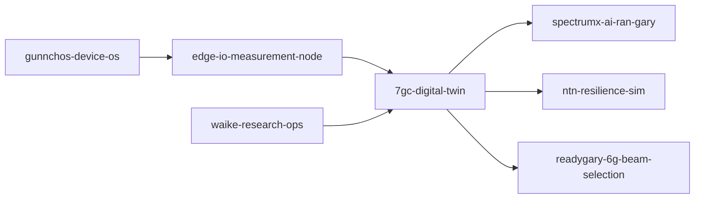

# 7GC Digital Twin — AI-RAN Research Scaffold
## End-to-End Research Artifact

| Item | Detail |
|------|--------|
| **Runs today** | Research prototype with smoke test (synthetic, non-evidence) |
| **Demo** | `make smoke` (smoke test only — not readiness proof) |
| **Data** | Synthetic only — no private IQ or PII |
| **Extend** | See [EXTERNAL_RESEARCHER_QUICKSTART.md](docs/EXTERNAL_RESEARCHER_QUICKSTART.md) |
| **Limits** | Not operational 6G; not Oulu affiliation; not carrier-grade |
| **Readiness** | [END_TO_END_READINESS.md](docs/END_TO_END_READINESS.md) |
| **Smoke test** | [E2E_RUN_RECORD.md](reproducibility/E2E_RUN_RECORD.md) |
| **Artifacts** | [results/e2e/](results/e2e/) |

**Spine repo** for the gunnchOS3k MLV **7GC AI-RAN Digital Twin Program**.

> **Research prototype / simulation scaffold** — not a claim of deployed 6G infrastructure.

## Thesis

Community-scale **AI-RAN + digital twin + edge device testbeds** for under-connected, spectrum-constrained communities.

- **Gary** — flagship node (node 1)
- **Ghana, Guyana, Gaza, Geelong, Graham Land, Germany** — comparative scenario nodes for research and future partnerships

## What this repo is

- Reproducible site-aware simulation scaffold
- Metrics library (fairness, spectral/energy efficiency, latency, NTN resilience hooks)
- Future lab/testbed integration contracts

## What this repo is not

- Operational carrier 6G network
- Certified consumer hardware
- Production telemetry store with PII


---

## What is this?

**Model community connectivity *before* deployment so planners can compare fair, efficient AI-RAN options.**

| | |
|---|---|
| **Status** | Evidence-building research scaffold · **Spine repo** |
| **Evidence today** | Level 1 smoke test — see [Evidence status](#evidence-status-smoke-test-vs-real-validation) |
| **Start** | [docs/START_HERE.md](docs/START_HERE.md) |

## What problem does this solve?

**Human:** Under-connected neighborhoods lack affordable, fair wireless planning tools; mistakes in deployment waste money and deepen digital inequality.

**Technical:** AI-RAN policies need site-aware digital twins with validated metrics—not guesswork from synthetic demos alone.

**Who is harmed if unsolved:** Residents, students, small businesses, and city partners who depend on reliable connectivity.

**Gary / 7GC / digital equality:** This repo supports equitable connectivity research for under-connected communities; Gary is the flagship urban anchor where applicable.

## Beginner mental model

A **flight simulator** for future community internet infrastructure—you can test policies without flying a real plane yet.

## How this repo addresses the problem

Site schemas, Gary flagship + comparative nodes, metrics library, CLI/Streamlit smoke paths, and contracts for Edge-IO, AI-RAN, and NTN repos.

**Main output:** `results/e2e/` summaries and exports (synthetic smoke only until calibrated data lands).

**Output does NOT prove:** Field-validated digital equality scores or operational carrier performance.

## How this fits gunnchOS3k MLV

Central spine for gunnchOS3k MLV 7GC program—feeds spectrumx, readygary, edge-io, ntn, WAIKE, device OS, and hardware roadmaps.

Deep dive: [docs/HOW_THIS_FITS_GUNNCHOS.md](docs/HOW_THIS_FITS_GUNNCHOS.md) · [docs/CROSS_REPO_DEPENDENCY_MAP.md](docs/CROSS_REPO_DEPENDENCY_MAP.md) (where present)

## How this fits 6G PhD research

Relevant themes: **Digital twins · AI-native RAN · digital equality · ubiquitous connectivity · edge measurement integration**

Oulu/CWC-style alignment (research direction, not affiliation claim): [docs/HOW_THIS_FITS_6G_PHD_RESEARCH.md](docs/HOW_THIS_FITS_6G_PHD_RESEARCH.md)

## What exists today

- Python package `seven_gc_twin`
- CLI + Streamlit
- `make smoke` / `make e2e`
- Metrics + toy scenario (smoke)
- Paper/diagram stubs
- Cross-repo contracts

Details: [docs/WHAT_IS_REAL_TODAY.md](docs/WHAT_IS_REAL_TODAY.md)

## Evidence status: smoke test vs real validation

- `make smoke` / `make e2e` = **CI smoke test** — proves code runs, **not** that research claims are field-validated.
- See [docs/NO_MORE_TOY_DEMOS.md](docs/NO_MORE_TOY_DEMOS.md) · [docs/EVIDENCE_STANDARD.md](docs/EVIDENCE_STANDARD.md) · [quality/CLAIMS_TO_EVIDENCE_MATRIX.md](quality/CLAIMS_TO_EVIDENCE_MATRIX.md)

**Next real evidence needed:**

- Calibrated/open GIS Gary scenario
- Validated equality metrics
- Edge-IO import
- Field validation protocol
- External reproduction

## Run or inspect this repo

```bash
python3 -m venv .venv && source .venv/bin/activate
pip install -r requirements.txt
make smoke
```

| | |
|---|---|
| **Output** | `results/e2e/gary_summary.md, gary_export.json` |
| **Means** | Reproducible smoke artifacts for CI and reviewers |
| **Does not mean** | Conference, adoption, or manufacturing readiness |

Video: [docs/video_walkthrough_script.md](docs/video_walkthrough_script.md)

## Full digital twin scenes (seven campuses)

Build complete scene trees (geo, 3D glTF, connectivity, population, use cases, cross-repo layers):

```bash
make validate-sites
make build-scenes-offline          # synthetic-fixture — default CI
make full-scenes                   # + optional open-data Overpass attempt
make conference-artifacts
streamlit run apps/streamlit_7gc_scene_dashboard.py
```

Outputs: `results/scenes/<site_id>/` · Conference: `results/conference/7gc_scene_table.md`

Diagram: [docs/diagrams/architecture_full_scene_pipeline.mmd](docs/diagrams/architecture_full_scene_pipeline.mmd)

**Evidence:** synthetic-fixture = `smoke_test_only`; open-data layers may be `open_data_backed` when Overpass succeeds. Not field validation.

## Visual map



More diagrams: [docs/diagrams/README.md](docs/diagrams/README.md) (if present) · [docs/uml/README.md](docs/uml/README.md) (spectrumx)

## Start here based on who you are

| Reader | Start here | You will learn |
|--------|------------|----------------|
| Beginner | [docs/PLAIN_ENGLISH_EXPLANATION.md](docs/PLAIN_ENGLISH_EXPLANATION.md) | Idea without jargon |
| Student / WAIKE | [docs/AUDIENCE_GUIDE.md](docs/AUDIENCE_GUIDE.md) | Learning path |
| Researcher / professor | [docs/HOW_THIS_FITS_6G_PHD_RESEARCH.md](docs/HOW_THIS_FITS_6G_PHD_RESEARCH.md) | Research fit |
| Contributor | [CONTRIBUTING.md](CONTRIBUTING.md) or Issues | How to help |
| City / school partner | [docs/PROBLEM_SOLUTION_MAP.md](docs/PROBLEM_SOLUTION_MAP.md) | Why it matters locally |

## What would make this final?

**Not satisfied yet** for final / conference / adoption / manufacturing gates—see audit:

- [docs/WHAT_WOULD_MAKE_THIS_FINAL.md](docs/WHAT_WOULD_MAKE_THIS_FINAL.md)
- [quality/FINAL_READINESS_CONFIRMATION.md](quality/FINAL_READINESS_CONFIRMATION.md)

## Roadmap from current state to final readiness

| Gate | Status |
|------|--------|
| Concept | Met |
| Smoke test | Met (`make smoke`) |
| Real evidence pipeline | Open |
| Benchmark / field data | Open |
| Internal validation | Open |
| External reproduction | Open |
| Candidate release | Open |
| Final | Not claimed |

Full table: [quality/READINESS_GATE_TABLE.md](quality/READINESS_GATE_TABLE.md)

## Related repos in the 7GC research spine


| Repo | Role |
|------|------|
| [7gc-digital-twin](https://github.com/gunnchOS3k/7gc-digital-twin) | Community digital twin spine |
| [spectrumx-ai-ran-gary](https://github.com/gunnchOS3k/spectrumx-ai-ran-gary) | AI-RAN + SpectrumX competition path |
| [readygary-6g-beam-selection](https://github.com/gunnchOS3k/readygary-6g-beam-selection) | Beam selection / PHY-facing evidence |
| [edge-io-measurement-node](https://github.com/gunnchOS3k/edge-io-measurement-node) | Privacy-first edge measurement |
| [ntn-resilience-sim](https://github.com/gunnchOS3k/ntn-resilience-sim) | NTN + terrestrial resilience |
| [waike-research-ops](https://github.com/gunnchOS3k/waike-research-ops) | Education & workforce pipeline |
| [gunnchos-hardware-industrial-design](https://github.com/gunnchOS3k/gunnchos-hardware-industrial-design) | Device hardware EVT planning |
| [gunnchos-device-os](https://github.com/gunnchOS3k/gunnchos-device-os) | School/research device OS prototype |
| [gunnchAI3k](https://github.com/gunnchOS3k/gunnchAI3k) | Learning assistant (where relevant) |


## Claims and non-claims

**Supports today:** Runnable scaffold, documented methods, smoke-test artifacts, honest limitations.

**Does not prove yet:** Field-validated digital equality scores or operational carrier performance.

**Requires evidence issues:** See GitHub `[Evidence TODO]` issues and `quality/CLAIMS_TO_EVIDENCE_MATRIX.md`.

---

## Quick start

```bash
python3 -m venv .venv && source .venv/bin/activate
pip install -r requirements.txt
pytest -q
streamlit run apps/streamlit_app.py
```

## Sibling repos

- [spectrumx-ai-ran-gary](https://github.com/gunnchOS3k/spectrumx-ai-ran-gary) — Gary AI-RAN benchmark
- [readygary-6g-beam-selection](https://github.com/gunnchOS3k/readygary-6g-beam-selection) — beam selection
- [edge-io-measurement-node](https://github.com/gunnchOS3k/edge-io-measurement-node) — field endpoints
- [ntn-resilience-sim](https://github.com/gunnchOS3k/ntn-resilience-sim) — NTN resilience

## License

MIT — see LICENSE.

## Industry / research-grade tooling alignment

| Tool / ecosystem | Why it matters | Adapter | Runs now? | Access? |
|------------------|----------------|---------|-----------|---------|
| See matrix | Evidence upgrade path | `industry_research_stack/` | Stub exports | Optional |

**Commands:** `make e2e` (includes tool export stubs) · `python3 scripts/run_all_tool_exports.py`

**Notice:** Aligned with public research ecosystems — [non-affiliation](industry_research_stack/NON_AFFILIATION_NOTICE.md). Smoke stubs only unless documented otherwise.

## Wireless engineering alignment

See [docs/WIRELESS_ENGINEERING_ALIGNMENT.md](docs/WIRELESS_ENGINEERING_ALIGNMENT.md).
