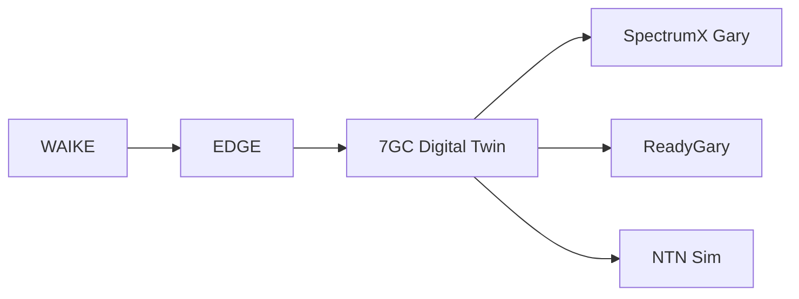

# 7GC Digital Twin — Community-Scale AI-RAN Research Scaffold

[](https://github.com/gunnchOS3k/7gc-digital-twin/actions/workflows/ci.yml)


> **Research prototype / simulation scaffold** — not operational 6G infrastructure.

**Thesis:** Community-scale AI-RAN + digital twin evaluation for trustworthy 6G in digitally underserved communities. **Gary** = flagship node; **7GC** = comparative scenario nodes.

## Supervisor quick start (3 min)

1. Read [`docs/SUPERVISOR_README.md`](docs/SUPERVISOR_README.md)
2. Run toy demo: `make demo` or `python -m seven_gc_twin.cli summarize gary`
3. See [`docs/OULU_CWC_ALIGNMENT.md`](docs/OULU_CWC_ALIGNMENT.md)

## Install

```bash
pip install -r requirements.txt
pytest -q
```

## Streamlit (optional)

```bash
streamlit run apps/streamlit_app.py
```

## Research spine



Full diagram: [`docs/diagrams/research_spine.mmd`](docs/diagrams/research_spine.mmd)

## Sibling repos

[spectrumx-ai-ran-gary](https://github.com/gunnchOS3k/spectrumx-ai-ran-gary) · [readygary-6g-beam-selection](https://github.com/gunnchOS3k/readygary-6g-beam-selection) · [edge-io-measurement-node](https://github.com/gunnchOS3k/edge-io-measurement-node) · [ntn-resilience-sim](https://github.com/gunnchOS3k/ntn-resilience-sim) · [waike-research-ops](https://github.com/gunnchOS3k/waike-research-ops)

## Limitations

Not carrier-grade 6G. Not Oulu affiliation. See [`docs/LIMITATIONS_AND_NON_CLAIMS.md`](docs/LIMITATIONS_AND_NON_CLAIMS.md).
