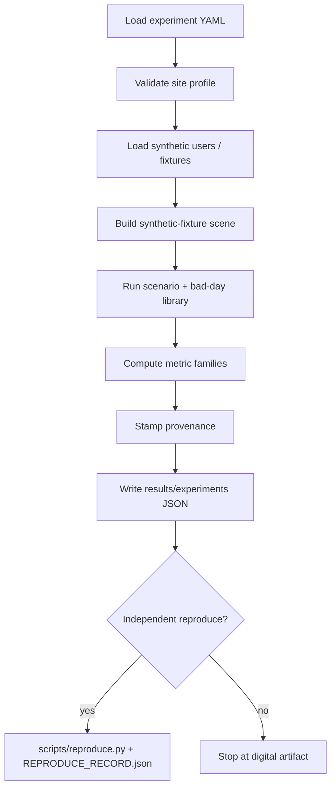

# Activity — RQ1 experiment (current)

```mermaid
flowchart TD
  A[Load experiment YAML] --> B[Validate site profile]
  B --> C[Load synthetic users / fixtures]
  C --> D[Build synthetic-fixture scene]
  D --> E[Run scenario + bad-day library]
  E --> F[Compute metric families]
  F --> G[Stamp provenance]
  G --> H[Write results/experiments JSON]
  H --> I{Independent reproduce?}
  I -->|yes| J[scripts/reproduce.py + REPRODUCE_RECORD.json]
  I -->|no| K[Stop at digital artifact]
```

Open-data Overpass merge is optional and fails closed to synthetic anchors.
