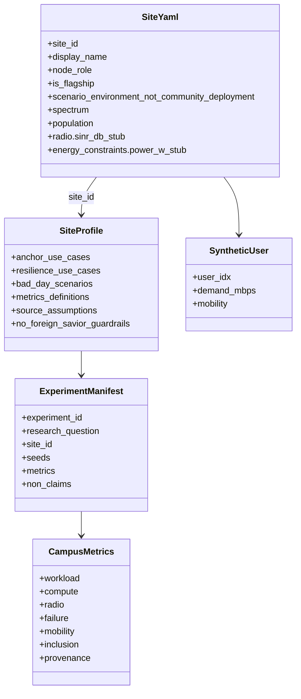

# Class — site / scenario (current)

Derived from `configs/sites/*.yaml`, `configs/site_profiles/*.yaml`, and `config/schema.py`.

`radio.sinr_db_stub` is a planning stub. It is not a measured SINR.
