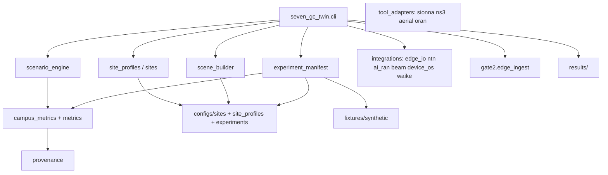

# Component — current

```mermaid
flowchart TB
  CLI[seven_gc_twin.cli]
  PROF[site_profiles / sites]
  ENG[scenario_engine]
  MET[campus_metrics + metrics]
  SCN[scene_builder]
  EXP[experiment_manifest]
  PROV[provenance]
  INT[integrations: edge_io ntn ai_ran beam device_os waike]
  ADAPT[tool_adapters: sionna ns3 aerial oran]
  G2[gate2.edge_ingest]
  YAML[configs/sites + site_profiles + experiments]
  FIX[fixtures/synthetic]
  OUT[results/]
  CLI --> PROF
  CLI --> ENG
  CLI --> SCN
  CLI --> EXP
  CLI --> INT
  CLI --> G2
  ENG --> MET
  EXP --> MET
  MET --> PROV
  PROF --> YAML
  SCN --> YAML
  EXP --> YAML
  EXP --> FIX
  CLI --> OUT
```

Optional backends (`tool_adapters`) export manifests only. They are not executed in default CI.
