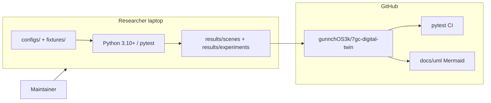

# Deployment — current

```mermaid
flowchart LR
  subgraph local [Researcher laptop]
    PY[Python 3.10+ / pytest]
    YAML[configs/ + fixtures/]
    RES[results/scenes + results/experiments]
  end
  subgraph github [GitHub]
    REPO[gunnchOS3k/7gc-digital-twin]
    GHA[pytest CI]
    UML[docs/uml Mermaid]
  end
  DEV[Maintainer] --> local
  PY --> RES
  YAML --> PY
  RES --> REPO
  REPO --> UML
  REPO --> GHA
```

There is **no** community site deployment, no Oulu lab claim, and no hosted digital-twin control plane in this repo.
