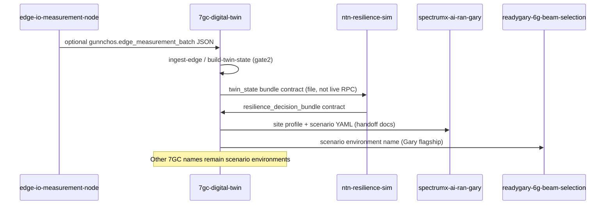

# Sequence — cross-repository (current)

Contract-level flow. Sibling repos are not executed inside this process except as optional JSON ingest.

If the field-kit schema sibling is absent, integration maps report `incompatible` rather than inventing a live link.
