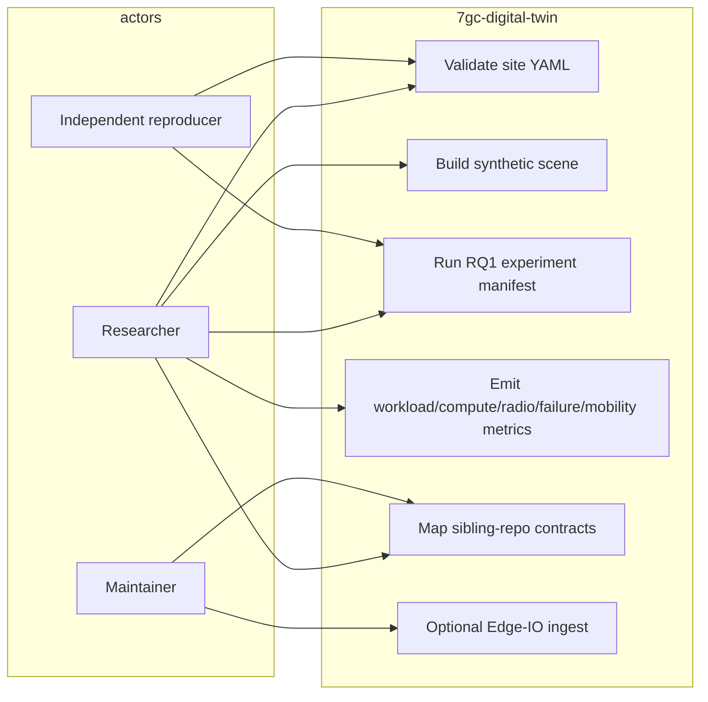

# Use case — current

Actors: researcher, independent reproducer, maintainer. This repo does **not** operate a community network.

Gary is the only flagship scenario. Other 7GC names are scenario environments.
