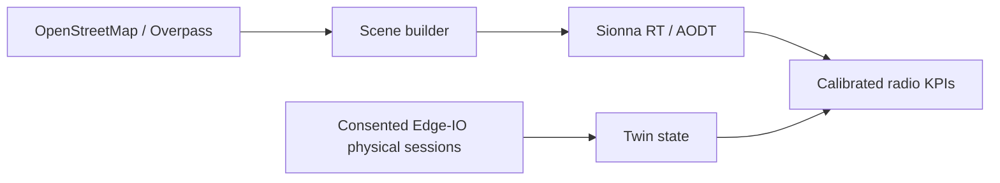

# Future — calibrated open-data scenes

```mermaid
flowchart LR
  OSM[OpenStreetMap / Overpass] --> SCN[Scene builder]
  EDGE[Consented Edge-IO physical sessions] --> TWIN[Twin state]
  SIONNA[Sionna RT / AODT] --> KPI[Calibrated radio KPIs]
  SCN --> SIONNA
  TWIN --> KPI
```

None of these run in default `make reproduce`. Status remains a target until provenance says `open_data_backed` or `controlled_device_measurement`.
